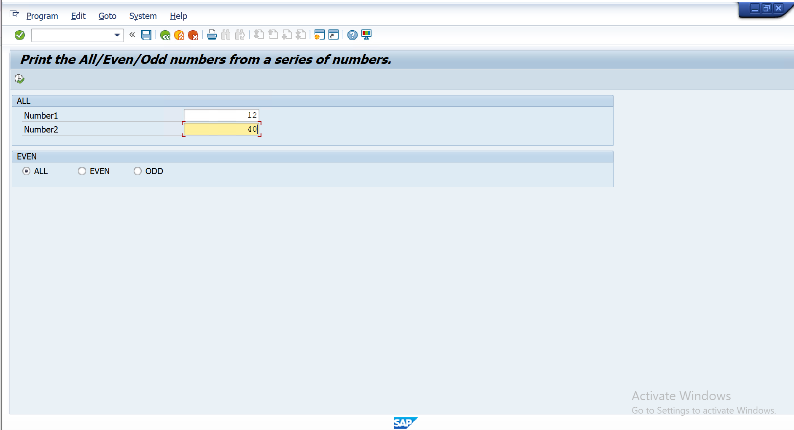
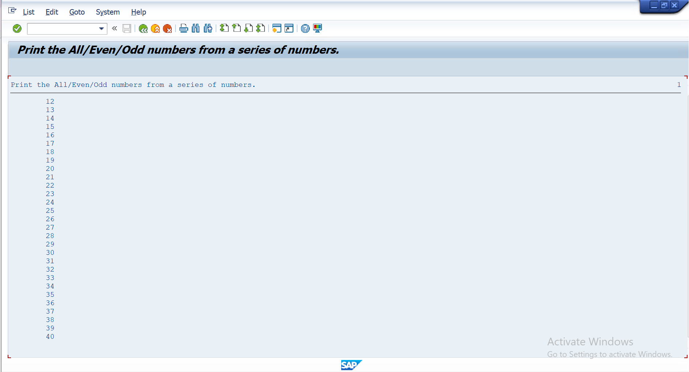
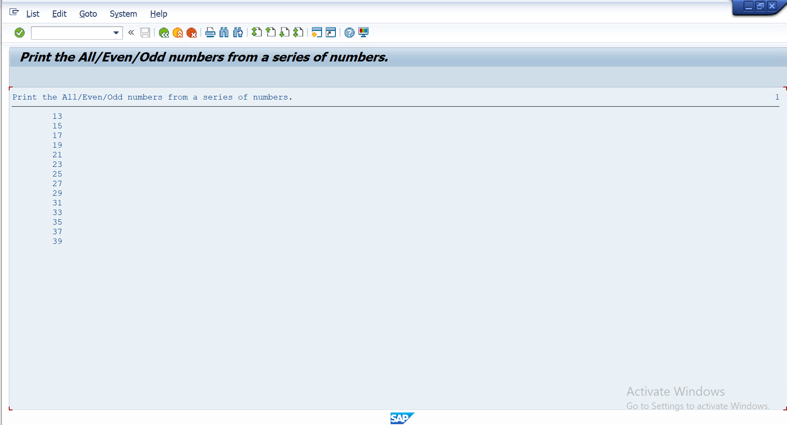
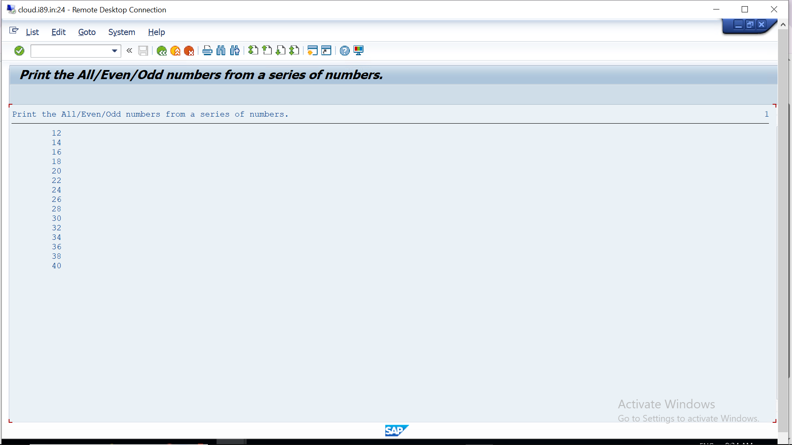

# Assignment 01 - Print All / Even / Odd Numbers

## 📖 Problem Statement

Write an ABAP Classical Report that prints **All**, **Even**, or **Odd** numbers within a user-specified range.

The user enters:

- From Number
- To Number

The user selects one of the following options using radio buttons:

- All Numbers
- Even Numbers
- Odd Numbers

---

## 🎯 Objective

The objective of this assignment is to understand:

- Selection Screen
- Parameters
- Radio Buttons
- Validation
- Loops
- Conditional Statements
- MOD Operator
- Classical Report Programming

---

## 🛠 SAP Concepts Used

- Classical Report
- Selection Screen Blocks
- Parameters
- Radio Buttons
- USER-COMMAND
- AT SELECTION-SCREEN Event
- START-OF-SELECTION Event
- DO...ENDDO Loop
- IF...ELSEIF...ENDIF
- EXIT Statement
- WRITE Statement
- MOD Operator
- MESSAGE Statement

---

## 📥 Input

| Field | Description |
|--------|-------------|
| From Number | Starting Number |
| To Number | Ending Number |
| Radio Button | All / Even / Odd |

---

## ✅ Validation

The program validates that:

```
From Number < To Number
```

If the validation fails, the following message is displayed:

```
Give the First Number Less Than Second Number
```

---

## ⚙️ Program Logic

1. Accept the starting and ending numbers.
2. Validate the input range.
3. Loop from the starting number to the ending number.
4. Check the selected radio button.
5. Display:
   - All numbers
   - Even numbers (`MOD 2 = 0`)
   - Odd numbers (`MOD 2 <> 0`)
6. Stop the loop when the ending number is reached.

---

## 📊 Sample Output

### Example 1

**Input**

```
From Number : 1
To Number   : 10

Selected : All
```

**Output**

```
1
2
3
4
5
6
7
8
9
10
```

---

### Example 2

**Input**

```
From Number : 1
To Number   : 10

Selected : Even
```

**Output**

```
2
4
6
8
10
```

---

### Example 3

**Input**

```
From Number : 1
To Number   : 10

Selected : Odd
```

**Output**

```
1
3
5
7
9
```

---

## 📂 Project Structure

```
Assignment-01
│
├── README.md
├── Assignment1.abap
├── INPUT.png
├── OUTPUT_ALL.png
├── OUTPUT_EVEN.png
└── OUTPUT_ODD.png
```

---

## 💡 Learning Outcomes

After completing this assignment, I learned:

- Creating Selection Screens
- Using Radio Buttons
- Input Validation
- Event Blocks in ABAP
- Looping Techniques
- Conditional Programming
- Number Processing using MOD
- Displaying Report Output

---

## 📸 Screenshots

### 📝 Input Screen



---

### 📊 Output - All Numbers



---

### 📊 Output - Even Numbers



---

### 📊 Output - Odd Numbers



---

## 👨‍💻 Author

**Krantikumar Patil**
