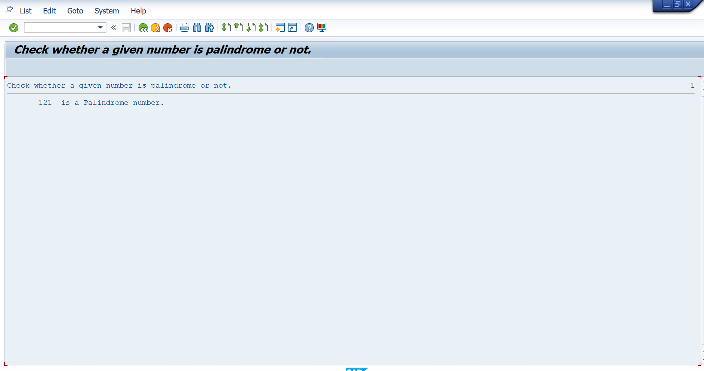
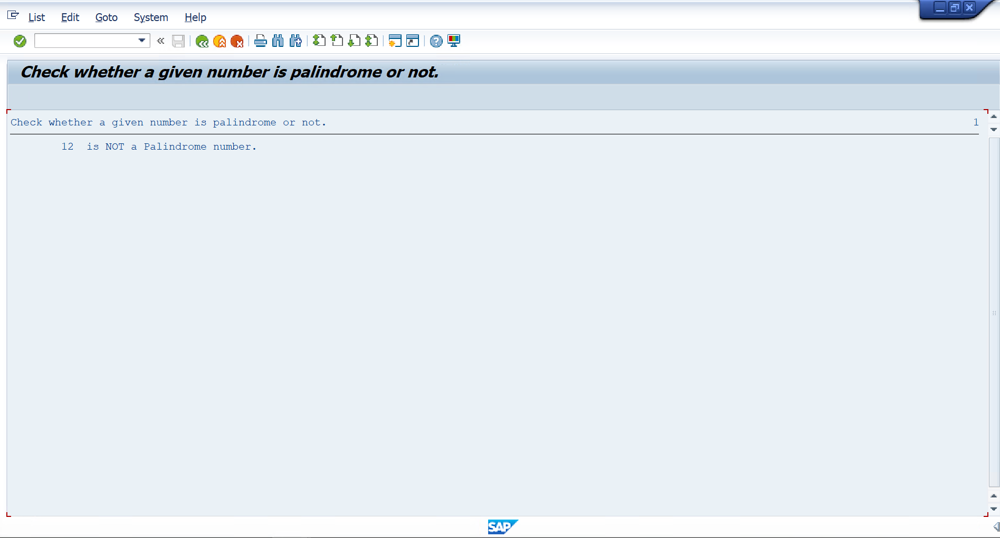

# Assignment 02 - Check Whether a Number is Palindrome or Not

## 📖 Problem Statement

Write an SAP ABAP Classical Report to check whether a given number is a **Palindrome Number** or **Not a Palindrome Number**.

A palindrome number remains the same when its digits are reversed.

**Examples:**

- 121 → Palindrome
- 252 → Palindrome
- 191 → Palindrome
- 123 → Not a Palindrome

---

## 🎯 Objective

The objective of this assignment is to understand:

- Number Manipulation
- Mathematical Operations
- WHILE Loop
- MOD Operator
- DIV Operator
- Conditional Statements
- Classical Report Programming

---

## 🛠 SAP Concepts Used

- Classical Report
- Parameters
- WHILE...ENDWHILE Loop
- IF...ELSE...ENDIF
- MOD Operator
- DIV Operator
- Mathematical Calculations
- WRITE Statement

---

## 📥 Input

| Field | Description |
|--------|-------------|
| Number | Integer value to check whether it is a palindrome |

---

## ⚙️ Program Logic

1. Accept an integer from the user.
2. Store the original number in a temporary variable.
3. Extract the last digit using the `MOD` operator.
4. Reverse the number mathematically.
5. Remove the last digit using the `DIV` operator.
6. Repeat the process until the number becomes zero.
7. Compare the reversed number with the original number.
8. Display whether the number is a palindrome or not.

---

## 📊 Sample Output

### Example 1

**Input**

```
121
```

**Output**

```
121 is a Palindrome number.
```

---

### Example 2

**Input**

```
252
```

**Output**

```
252 is a Palindrome number.
```

---

### Example 3

**Input**

```
123
```

**Output**

```
123 is NOT a Palindrome number.
```

---

## 📂 Project Structure

```
Assignment-02/
│
├── Assignment2.abap
├── README.md
├── INPUT.png
├── OUTPUT_PALINDROME.png
└── OUTPUT_NOT_PALINDROME.png
```

---

## 💡 Learning Outcomes

After completing this assignment, I learned:

- Working with integer variables
- Using the `WHILE` loop
- Extracting digits using the `MOD` operator
- Removing digits using the `DIV` operator
- Reversing a number mathematically
- Comparing values using conditional statements
- Developing simple mathematical programs in SAP ABAP

---

## 🚀 Future Improvements

- Display the result using colored output (Green for Palindrome, Red for Not Palindrome).
- Accept multiple numbers using an Internal Table.
- Display the reverse number before showing the final result.
- Extend the program to check palindromes for strings.

---

## 📸 Screenshots

### 📝 Input Screen

<p align="center">
  
</p>

---

### ✅ Palindrome Output

<p align="center">
  
</p>

---

### ❌ Not Palindrome Output

<p align="center">
  
</p>

---

## 👨‍💻 Author

**Krantikumar Patil**

SAP ABAP on HANA Learner

## 🤝 Connect With Me

- 💼 **LinkedIn:** [Krantikumar Patil](https://www.linkedin.com/in/krantikumarpatil4211/)
- 🌐 **Portfolio:** [Kranti AI Portfolio](https://kranti-ai.vercel.app/)