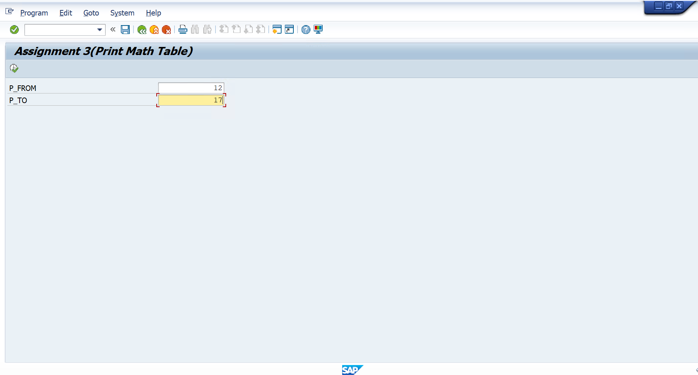
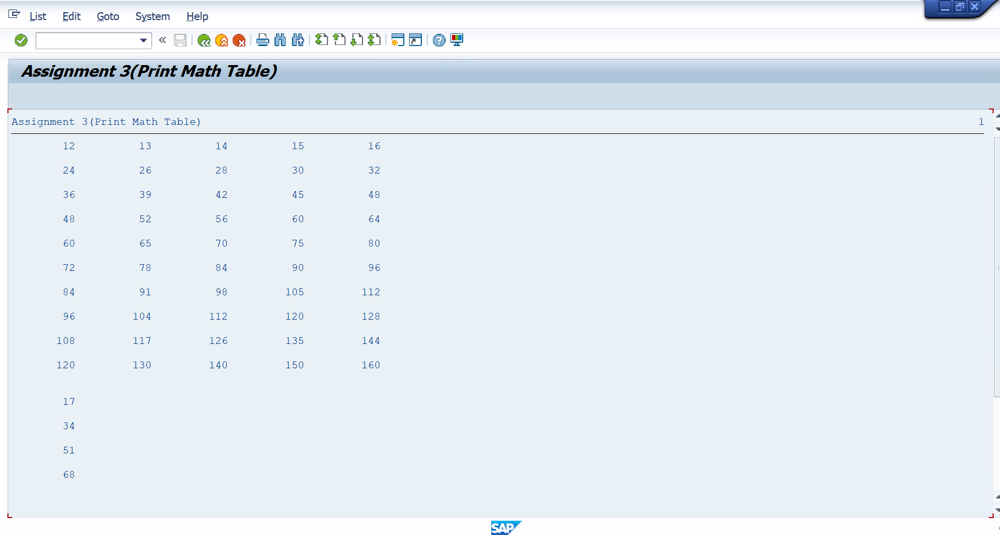
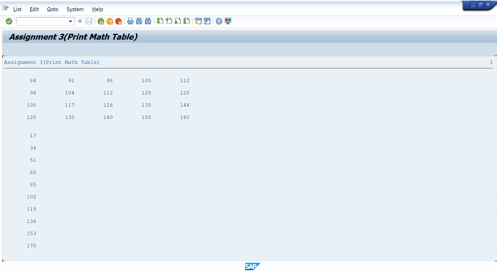

# Assignment 03 - Print Mathematical Table

## 📖 Problem Statement

Write an SAP ABAP Classical Report to generate multiplication tables for a given range of numbers.

The user enters:

- From Number
- To Number

The program prints the multiplication tables (1 to 10) for every number in the specified range.

Each row displays the multiplication result, and five tables are displayed together before moving to the next set.

---

## 🎯 Objective

The objective of this assignment is to understand:

- Nested WHILE Loops
- Mathematical Calculations
- Report Formatting
- User Input Validation
- Classical Report Programming

---

## 🛠 SAP Concepts Used

- Classical Report
- Parameters
- START-OF-SELECTION Event
- IF...ELSE...ENDIF
- WHILE...ENDWHILE
- Arithmetic Operations
- WRITE Statement
- SKIP Statement

---

## 📥 Input

| Field | Description |
|--------|-------------|
| From Number | Starting Table Number |
| To Number | Ending Table Number |

---

## ✅ Validation

The program validates that:

```
From Number < To Number
```

If the validation fails, the following message is displayed:

```
From number should be less than To number
```

---

## ⚙️ Program Logic

1. Accept the starting and ending numbers.
2. Validate the input range.
3. Generate multiplication tables from the starting number to the ending number.
4. Print multiplication values from 1 to 10.
5. Display five tables together for better readability.
6. Continue until all requested tables are displayed.

---

## 📊 Sample Output

### Example

**Input**

```
From Number : 2
To Number   : 6
```

**Output**

```
2   3   4   5   6
4   6   8  10  12
6   9  12  15  18
8  12  16  20  24
10 15  20  25  30
...
20 30  40  50  60
```

---

## 📂 Project Structure

```
Assignment-03/
│
├── Assignment03.abap
├── README.md
├── USERINPUT.png
└── OUTPUT_RESULT1.png
└── OUTPUT_RESULT2.png
```

---

## 💡 Learning Outcomes

After completing this assignment, I learned:

- Working with nested WHILE loops
- Using arithmetic calculations
- Formatting report output
- Validating user input
- Printing structured reports in SAP ABAP

---

## 🚀 Future Improvements

- Display multiplication tables using ALV Grid.
- Add color formatting for each table.
- Export the output to Excel.
- Allow users to specify the multiplication limit instead of a fixed range (1–10).

---

## 📸 Screenshots

### 📝 Input Screen

<p align="center">
  
</p>

---

### 📊 Output Screen

<p align="center">
  
</p>

---

<p align="center">
  
</p>

---

## 👨‍💻 Author

**Krantikumar Patil**

SAP ABAP on HANA Learner

## 🤝 Connect With Me

- 💼 **LinkedIn:** [Krantikumar Patil](https://www.linkedin.com/in/krantikumarpatil4211/)
- 🌐 **Portfolio:** [Kranti AI Portfolio](https://kranti-ai.vercel.app/)
