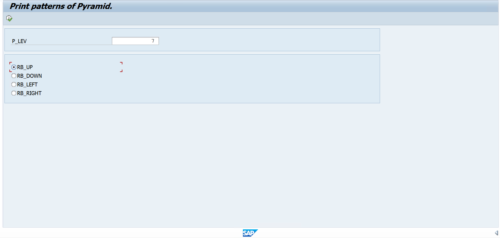
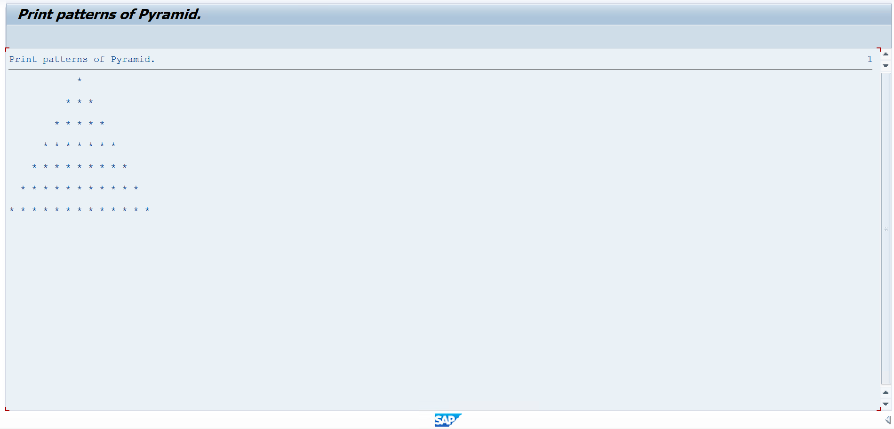
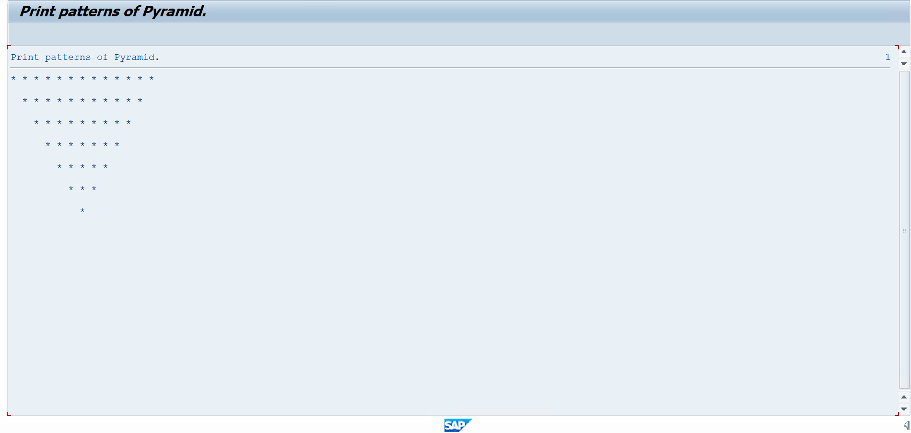
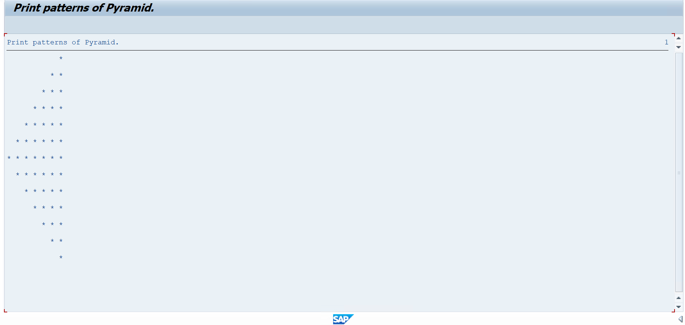
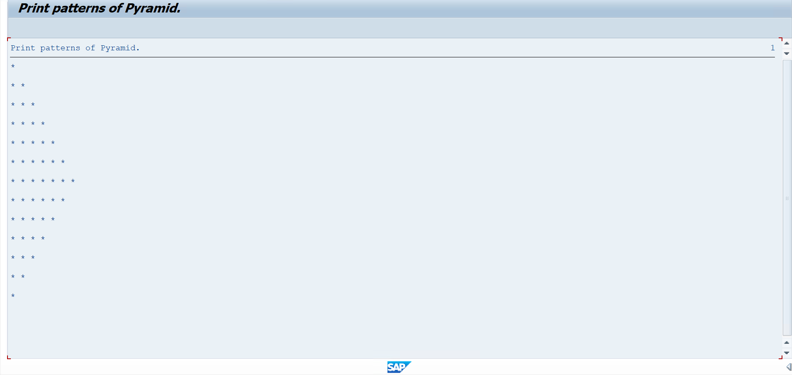

# Assignment 04 - Print Patterns of Pyramid

## 📖 Problem Statement

Write an SAP ABAP Classical Report to print different **Pyramid Patterns** based on the number of levels entered by the user.

The user enters the number of levels and selects one of the following patterns using radio buttons:

* 🔺 UP
* 🔻 DOWN
* ◀️ LEFT
* ▶️ RIGHT

---

## 🎯 Objective

The objective of this assignment is to understand:

* Selection Screen
* Parameters
* Radio Buttons
* Input Validation
* WHILE Loop
* Nested WHILE Loops
* Pattern Printing
* Spaces and Stars
* Conditional Statements
* Classical Report Programming

---

## 🛠 SAP Concepts Used

* Classical Report
* Selection Screen Blocks
* Parameters
* Radio Buttons
* Radio Button Group
* `AT SELECTION-SCREEN`
* `START-OF-SELECTION`
* `WHILE...ENDWHILE`
* `IF...ENDIF`
* `WRITE` Statement
* `MESSAGE` Statement
* Nested Loops

---

## 📥 Input

| Field | Description                          |
| ----- | ------------------------------------ |
| Level | Number of rows/levels in the pattern |
| UP    | Prints an upward pyramid             |
| DOWN  | Prints a downward pyramid            |
| LEFT  | Prints a left-side pyramid           |
| RIGHT | Prints a right-side pyramid          |

---

## 🖥️ Selection Screen

The program provides four radio button options for selecting the required pyramid pattern.

<p align="center">
  
</p>

### Available Pattern Options

```text
UP
DOWN
LEFT
RIGHT
```

---

## ✅ Validation

The program validates that the entered level is greater than zero.

```text
Level > 0
```

If the user enters `0` or a negative value, the following message is displayed:

```text
Enter number greater than zero
```

---

# ⚙️ Program Logic

## 🔺 1. UP Pattern

The program starts from the first row and increases the number of stars for every subsequent row.

For example, if:

```text
Level = 4
```

Output:

```text
   *
  ***
 *****
*******
```

### Logic

* Start row from `1`.
* Calculate spaces using:

```text
Level - Row
```

* Calculate stars using:

```text
2 × Row - 1
```

* Continue until the selected level is reached.

### 📸 UP Pattern Output

<p align="center">
  
</p>

---

# 🔻 2. DOWN Pattern

The DOWN pattern starts with the maximum number of stars and decreases the number of stars in every row.

For example:

```text
*******
 *****
  ***
   *
```

### Logic

* Start the row from the selected level.
* Decrease the row number after each iteration.
* Calculate spaces and stars for every row.

### 📸 DOWN Pattern Output

<p align="center">
  
</p>

---

# ◀️ 3. LEFT Pattern

The LEFT pattern increases the number of stars up to the selected level and then decreases them.

For example:

```text
   *
  **
 ***
****
 ***
  **
   *
```

### Logic

The program uses two parts:

1. Increasing pattern
2. Decreasing pattern

Nested `WHILE` loops are used to control spaces and stars.

### 📸 LEFT Pattern Output

<p align="center">
  
</p>

---

# ▶️ 4. RIGHT Pattern

The RIGHT pattern increases the number of stars up to the selected level and then decreases them.

For example:

```text
*
**
***
****
***
**
*
```

### Logic

The program uses:

* One loop for the increasing part.
* One loop for the decreasing part.

### 📸 RIGHT Pattern Output

<p align="center">
  
</p>

---

# 🧠 Pattern Generation Logic

The program uses **nested WHILE loops**.

### Spaces

Spaces are generated using:

```text
lv_space
```

### Stars

Stars are generated using:

```text
lv_star
```

### Row

The current row is controlled using:

```text
lv_row
```

The program changes the values of these variables depending on the selected radio button.

---

## 📊 Example

### Input

```text
Level : 4
Pattern : UP
```

### Output

```text
   *
  ***
 *****
*******
```

---

## 📂 Project Structure

```text
Assignment-04/
│
├── Assignment04.abap
├── README.md
├── USERINPUT.png
├── OUTPUT_UP.png
├── OUTPUT_DOWN.png
├── OUTPUT_LEFT.png
└── OUTPUT_RIGHT.png
```

---

## 💡 Learning Outcomes

After completing this assignment, I learned:

* How to create selection screen blocks.
* How to use radio buttons.
* How to group radio buttons using a radio button group.
* How to validate user input.
* How to use nested `WHILE` loops.
* How to generate spaces and stars dynamically.
* How to create different patterns using ABAP logic.
* How to implement increasing and decreasing patterns.
* How to display formatted output using a Classical Report.

---

# 📸 Screenshots

## 📝 Selection Screen - All Pattern Options

<p align="center">
  
</p>

---

## 🔺 UP Pattern

<p align="center">
  
</p>

---

## 🔻 DOWN Pattern

<p align="center">
  
</p>

---

## ◀️ LEFT Pattern

<p align="center">
  
</p>

---

## ▶️ RIGHT Pattern

<p align="center">
  
</p>

---

## 👨‍💻 Author

**Krantikumar Patil**

SAP ABAP on HANA Learner

## 🤝 Connect With Me

* 💼 **LinkedIn:** [Krantikumar Patil](https://www.linkedin.com/in/krantikumarpatil4211/)
* 🌐 **Portfolio:** [Kranti AI Portfolio](https://kranti-ai.vercel.app/)

---

⭐ If you found this project helpful, consider giving this repository a **Star**!

### 🚀 SAP ABAP Learning Journey

**Day 04 / 30 — SAP ABAP Classical Report Assignments**
