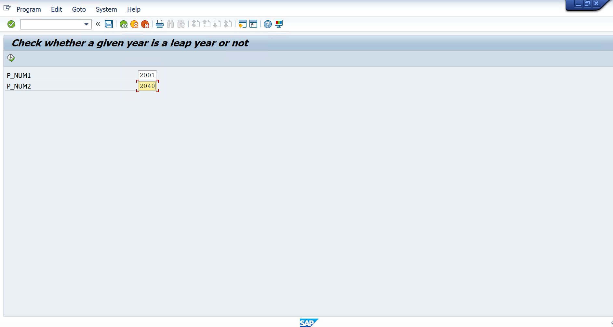
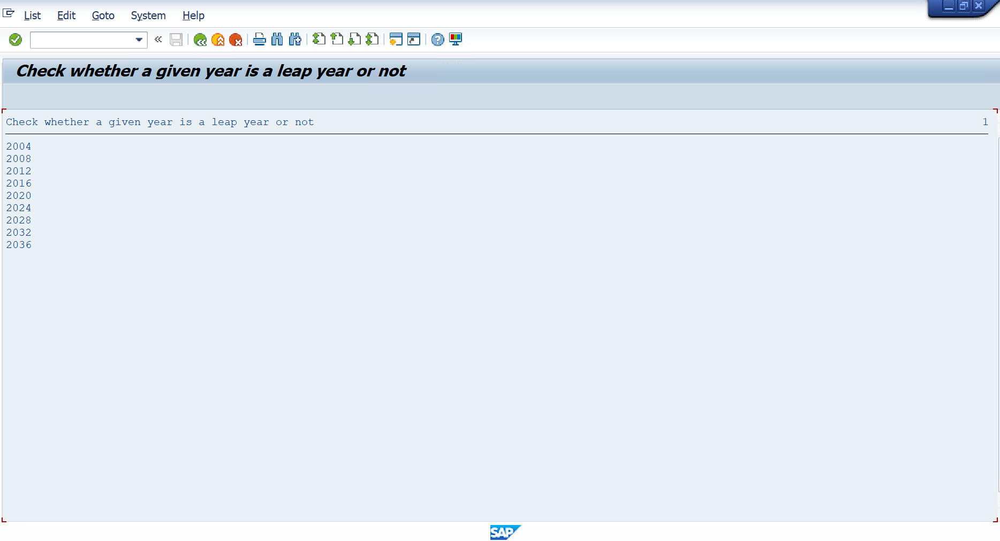

# Assignment 05 - Check Leap Years Between Two Years

## 📖 Problem Statement

Write an SAP ABAP Classical Report to display all **Leap Years** between a given range of years.

The user enters:

- From Year
- To Year

The program validates that the difference between the two years does not exceed **40 years** and then prints all leap years within the specified range.

---

## 🎯 Objective

The objective of this assignment is to understand:

- Input Validation
- Selection Screen Events
- WHILE Loop
- Arithmetic Operators
- MOD Operator
- Leap Year Logic
- Classical Report Programming

---

## 🛠 SAP Concepts Used

- Classical Report
- Parameters
- AT SELECTION-SCREEN
- START-OF-SELECTION
- WHILE...ENDWHILE
- IF...ENDIF
- MOD Operator
- MESSAGE Statement
- WRITE Statement

---

## 📥 Input

| Field | Description |
|--------|-------------|
| From Year | Starting Year |
| To Year | Ending Year |

---

## ✅ Validation

The program validates that:

```
(To Year - From Year) ≤ 40
```

If the difference exceeds 40 years, the following message is displayed:

```
Give The YEAR GAP Between 40 or Less
```

---

## ⚙️ Program Logic

1. Accept the starting year and ending year.
2. Calculate the difference between the two years.
3. Validate that the range is **40 years or less**.
4. Iterate through each year using a `WHILE` loop.
5. Check whether the current year is a leap year using:
   - Divisible by 4 and not divisible by 100, **or**
   - Divisible by 400
6. Display all leap years in the specified range.

---

## 📊 Sample Output

### Example

**Input**

```
From Year : 2000
To Year   : 2012
```

**Output**

```
Leap Years

2000
2004
2008
2012
```

---

### Example (Invalid Input)

**Input**

```
From Year : 1980
To Year   : 2025
```

**Output**

```
Give The YEAR GAP Between 40 or Less
```

---

## 📂 Project Structure

```text
Assignment-05/
│
├── Assignment05.abap
├── README.md
├── USER_INPUT.png
└── RESULT.png
```

---

## 💡 Learning Outcomes

After completing this assignment, I learned:

- Performing input validation
- Using `AT SELECTION-SCREEN`
- Implementing leap year logic
- Working with the `MOD` operator
- Using `WHILE` loops
- Displaying report output in SAP ABAP

---

## 📸 Screenshots

### 📝 User Input

<p align="center">
  
</p>

---

<p align="center">
  
</p>

---

## 👨‍💻 Author

**Krantikumar Patil**

SAP ABAP on HANA Learner

## 🤝 Connect With Me

- 💼 **LinkedIn:** [Krantikumar Patil](https://www.linkedin.com/in/krantikumarpatil4211/)
- 🌐 **Portfolio:** [Kranti AI Portfolio](https://kranti-ai.vercel.app/)

---
