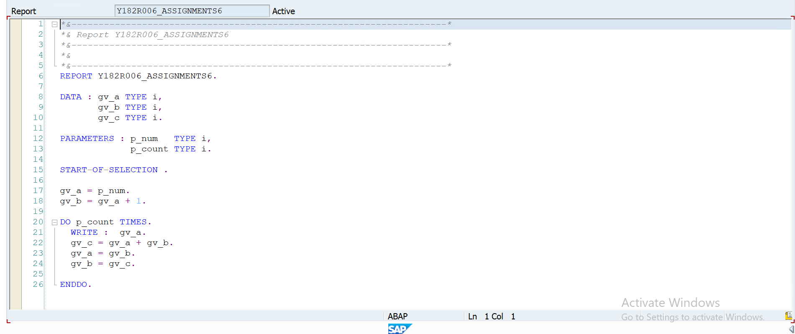
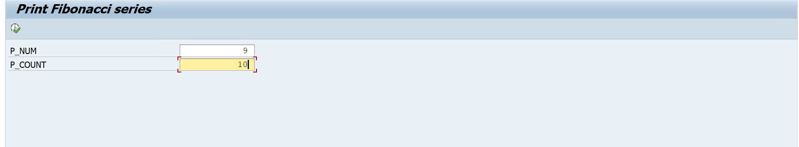
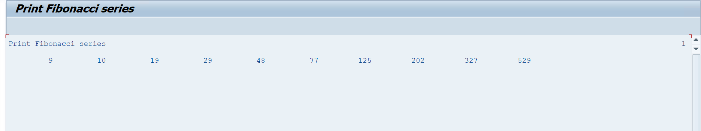

# Assignment 06 - Fibonacci Series

## 📖 Problem Statement

Write an SAP ABAP Classical Report to generate a **Fibonacci Series** based on the user-provided starting number and number of terms.

The user enters:

* Starting Number
* Number of Fibonacci Terms

The program generates and displays the Fibonacci series using a `DO` loop.

---

## 🎯 Objective

The objective of this assignment is to understand:

* Parameters
* Variables
* DO Loop
* Arithmetic Operations
* Variable Swapping
* Sequential Number Generation
* Classical Report Programming

---

## 🛠 SAP Concepts Used

* Classical Report
* Selection Screen
* Parameters
* `START-OF-SELECTION`
* `DO...ENDDO`
* `WRITE` Statement
* Integer Variables
* Arithmetic Operators
* Sequential Processing

---

## 📥 Input

| Field        | Description                            |
| ------------ | -------------------------------------- |
| Start Number | Starting value of the Fibonacci series |
| Count        | Number of terms to generate            |

---

## ⚙️ Program Logic

The program uses three variables:

```text
gv_a → Current Number
gv_b → Next Number
gv_c → Temporary Number
```

### Logic

1. Accept the starting number from the user.
2. Initialize `gv_a` with the starting number.
3. Set `gv_b` to the next number.
4. Execute the loop for the specified number of times.
5. Display the current value of `gv_a`.
6. Calculate the next value:

```text
gv_c = gv_a + gv_b
```

7. Update the values:

```text
gv_a = gv_b
gv_b = gv_c
```

8. Continue until the requested number of terms is generated.

---

## 📊 Sample Output

### Example 1

**Input**

```text
Start Number : 0
Count        : 5
```

**Output**

```text
0 1 1 2 3
```

---

### Example 2

**Input**

```text
Start Number : 2
Count        : 5
```

**Output**

```text
2 3 5 8 13
```

---

## 🧮 Fibonacci Logic

The next number is calculated by adding the previous two numbers:

```text
Next Number = Current Number + Next Number
```

Example:

```text
0, 1
  ↓
0 + 1 = 1
  ↓
1 + 1 = 2
  ↓
1 + 2 = 3
  ↓
2 + 3 = 5
```

Result:

```text
0 1 1 2 3 5 ...
```

---

## 📂 Project Structure

```text
Assignment-06/
│
├── Assignment-06.txt
├── README.md
├── CODE.png
├── OUTPUT_USERNO.png
└── OUTPUT_RESULT.png
```

---

## 💡 Learning Outcomes

After completing this assignment, I learned:

* How to use `DO...ENDDO` loops.
* How to generate a sequence using arithmetic operations.
* How to update multiple variables during loop execution.
* How to work with user-defined parameters.
* How to implement Fibonacci logic in SAP ABAP.
* How to display calculated results using a Classical Report.

---

## 📸 Screenshots

### 💻 ABAP Source Code

<p align="center">
  
</p>

---

### 📝 User Input

<p align="center">
  
</p>

---

### 📊 Output Result

<p align="center">
  
</p>

---

## 👨‍💻 Author

**Krantikumar Patil**

SAP ABAP on HANA Learner

## 🤝 Connect With Me

* 💼 **LinkedIn:** [Krantikumar Patil](https://www.linkedin.com/in/krantikumarpatil4211/)
* 🌐 **Portfolio:** [Kranti AI Portfolio](https://kranti-ai.vercel.app/)

---

