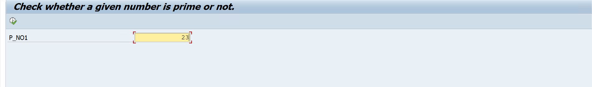
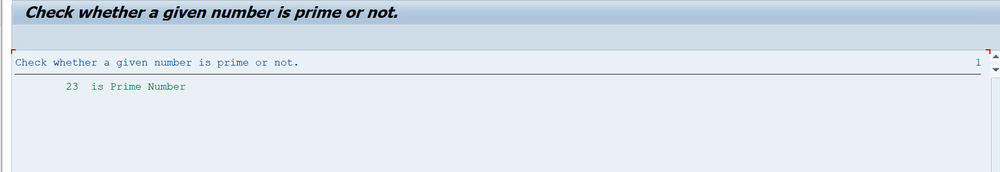
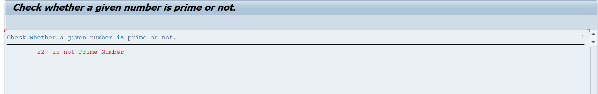

# Assignment 07 - Check Whether a Number is Prime or Not

## 📖 Problem Statement

Write an SAP ABAP Classical Report to check whether a given number is a **Prime Number** or **Not a Prime Number**.

A prime number is a number that has exactly **two factors**:

* 1
* The number itself

### Examples

```text
7 → Prime Number
8 → Not a Prime Number
```

---

## 🎯 Objective

The objective of this assignment is to understand:

* Parameters
* DO Loop
* MOD Operator
* Counter Logic
* Conditional Statements
* Classical Report Programming
* Colored Output

---

## 🛠 SAP Concepts Used

* Classical Report
* Selection Screen
* Parameters
* `START-OF-SELECTION`
* `DO...ENDDO`
* `IF...ELSE...ENDIF`
* `MOD` Operator
* Counter Variable
* `WRITE` Statement
* `COLOR` Addition
* `INVERSE` Addition

---

## 📥 Input

| Field  | Description                    |
| ------ | ------------------------------ |
| Number | Number to be checked for Prime |

---

## ⚙️ Program Logic

The program determines whether the input number is prime by counting how many numbers exactly divide it.

### Logic

1. Accept a number from the user.
2. Initialize the divisor variable with `1`.
3. Run a `DO` loop for the given number of times.
4. Check whether the input number is exactly divisible by the current divisor using:

```text
p_no1 MOD lv_no1 = 0
```

5. If the remainder is zero, increment the divisor count.
6. Continue checking all possible divisors.
7. If the total divisor count is exactly `2`, the number is a prime number.
8. Otherwise, the number is not a prime number.
9. Display the result using colored output.

---

## 🧮 Prime Number Logic

For example, consider:

```text
Input: 7
```

The divisors of `7` are:

```text
1
7
```

Total divisors:

```text
2
```

Therefore:

```text
7 is Prime Number
```

For:

```text
Input: 8
```

The divisors are:

```text
1
2
4
8
```

Total divisors:

```text
4
```

Therefore:

```text
8 is not Prime Number
```

---

## 📊 Sample Output

### Example 1 - Prime Number

**Input**

```text
Number : 7
```

**Output**

```text
7 is Prime Number
```

The program displays the Prime Number result using colored output.

---

### Example 2 - Not a Prime Number

**Input**

```text
Number : 8
```

**Output**

```text
8 is not Prime Number
```

The program displays the Not Prime Number result using colored output.

---

## 📂 Project Structure

```text
Assignment-07/
│
├── Assignment07.abap
├── README.md
├── OUTPUT_USERINPUR.png
├── OUTPUT1.png
└── OUTPUT2.png
```

---

## 💡 Learning Outcomes

After completing this assignment, I learned:

* How to use the `DO` loop.
* How to use the `MOD` operator.
* How to count the number of divisors.
* How to determine whether a number is prime.
* How to use conditional statements.
* How to display colored output in a Classical Report.
* How to work with counters in ABAP.

---

## 📸 Screenshots

### 📝 User Input

<p align="center">
  
</p>

---

### 🟢 Prime Number Output

<p align="center">
  
</p>

---

### 🔴 Not Prime Number Output

<p align="center">
  
</p>

---

## 👨‍💻 Author

**Krantikumar Patil**

SAP ABAP on HANA Learner

## 🤝 Connect With Me

* 💼 **LinkedIn:** [Krantikumar Patil](https://www.linkedin.com/in/krantikumarpatil4211/)
* 🌐 **Portfolio:** [Kranti AI Portfolio](https://kranti-ai.vercel.app/)

---

