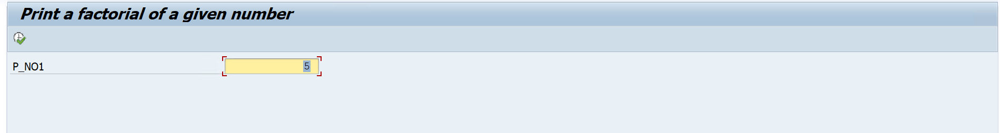

# Assignment 08 - Calculate Factorial of a Number

## 📖 Problem Statement

Write an SAP ABAP Classical Report to calculate the **factorial of a given number**.

The user enters a number as input, and the program calculates and displays its factorial.

### Example

```text
Input:
6

Output:
720
```

---

## 🎯 Objective

The objective of this assignment is to understand:

* Parameters
* Variables
* DO Loop
* Multiplication
* Decrementing a Value
* Iterative Calculations
* Classical Report Programming

---

## 🛠 SAP Concepts Used

* Classical Report
* Selection Screen
* Parameters
* `START-OF-SELECTION`
* `DO...ENDDO`
* Arithmetic Operators
* Integer Variables
* `WRITE` Statement

---

## 📥 Input

| Field  | Description                                   |
| ------ | --------------------------------------------- |
| Number | Number whose factorial needs to be calculated |

---

## ⚙️ Program Logic

The program calculates the factorial by repeatedly multiplying the current factorial value with the decreasing number.

### Logic

1. Accept a number from the user.
2. Initialize the factorial variable with `1`.
3. Store the input number in a temporary variable.
4. Execute a `DO` loop for the given number of times.
5. Multiply the factorial value by the current temporary number.
6. Decrease the temporary number by `1`.
7. Repeat until all required multiplications are completed.
8. Display the calculated factorial.

---

## 🧮 Factorial Calculation

For example:

```text
6! = 6 × 5 × 4 × 3 × 2 × 1
```

Calculation:

```text
6 × 5 = 30
30 × 4 = 120
120 × 3 = 360
360 × 2 = 720
720 × 1 = 720
```

Therefore:

```text
6! = 720
```

---

## 📊 Sample Output

### Example

**Input**

```text
Number : 6
```

**Output**

```text
720
```

---

## 📂 Project Structure

```text
Assignment-08/
│
├── Assignment08.abap
├── README.md
├── INPUT.png
└── OUTPUT_RESULT.png
```

---

## 💡 Learning Outcomes

After completing this assignment, I learned:

* How to initialize variables.
* How to use the `DO` loop.
* How to perform repeated multiplication.
* How to decrement a variable inside a loop.
* How to calculate factorial using iterative logic.
* How to display the result using a Classical Report.

---

## 📸 Screenshots

### 📝 User Input

<p align="center">
  
</p>

---

### 📊 Factorial Output

<p align="center">
  
</p>

---

## 👨‍💻 Author

**Krantikumar Patil**

SAP ABAP on HANA Learner

## 🤝 Connect With Me

* 💼 **LinkedIn:** [Krantikumar Patil](https://www.linkedin.com/in/krantikumarpatil4211/)
* 🌐 **Portfolio:** [Kranti AI Portfolio](https://kranti-ai.vercel.app/)

---

### 🚀 SAP ABAP Learning Journey

**Day 08 / 30 — SAP ABAP Classical Report Assignments**
