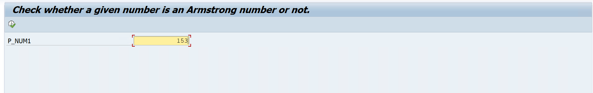

# Assignment 09 - Check Whether a Number is Armstrong or Not

## 📖 Problem Statement

Write an SAP ABAP Classical Report to check whether a given number is an **Armstrong Number** or **Not an Armstrong Number**.

### Examples

```text
153 → Armstrong Number
233 → Not an Armstrong Number
```

For this assignment, the program calculates the sum of the **cubes of the individual digits** and compares the result with the original number.

---

## 🎯 Objective

The objective of this assignment is to understand:

* Parameters
* WHILE Loop
* MOD Operator
* DIV Operator
* Digit Extraction
* Mathematical Operations
* Conditional Statements
* Colored Output
* Classical Report Programming

---

## 🛠 SAP Concepts Used

* Classical Report
* Selection Screen
* Parameters
* `START-OF-SELECTION`
* `WHILE...ENDWHILE`
* `IF...ELSE...ENDIF`
* `MOD` Operator
* `DIV` Operator
* Arithmetic Operations
* `WRITE` Statement
* `COLOR` Addition
* `INVERSE` Addition

---

## 📥 Input

| Field  | Description                        |
| ------ | ---------------------------------- |
| Number | Number to be checked for Armstrong |

---

## ⚙️ Program Logic

The program extracts each digit from the input number and calculates the sum of the cubes of those digits.

### Logic

1. Accept a number from the user.
2. Store the input number in a temporary variable.
3. Initialize the sum to `0`.
4. Extract the last digit using the `MOD` operator.
5. Calculate the cube of the extracted digit.
6. Add the cube to the total sum.
7. Remove the last digit using the `DIV` operator.
8. Repeat the process until all digits are processed.
9. Compare the calculated sum with the original number.
10. If both values are equal, display the number as an Armstrong number.
11. Otherwise, display it as not an Armstrong number.

---

## 🧮 Armstrong Number Logic

### Example: 153

The digits are:

```text
1
5
3
```

Calculate:

```text
1³ + 5³ + 3³

= 1 + 125 + 27

= 153
```

Since:

```text
153 = 153
```

Therefore:

```text
153 is an Armstrong Number
```

---

### Example: 233

Calculate:

```text
2³ + 3³ + 3³

= 8 + 27 + 27

= 62
```

Since:

```text
62 ≠ 233
```

Therefore:

```text
233 is not an Armstrong Number
```

---

## 📊 Sample Output

### 🟢 Example 1 - Armstrong Number

**Input**

```text
Number : 153
```

**Output**

```text
153 Given No is Armstrong
```

The result is displayed using colored output.

---

### 🔴 Example 2 - Not an Armstrong Number

**Input**

```text
Number : 233
```

**Output**

```text
233 Given No is not Armstrong
```

The result is displayed using colored output.

---

## 📂 Project Structure

```text
Assignment-09/
│
├── Assignment09.abap
├── README.md
├── INPUT.png
├── OUTPUT1.png
└── OUTPUT2.png
```

---

## 💡 Learning Outcomes

After completing this assignment, I learned:

* How to extract individual digits from a number.
* How to use the `MOD` operator.
* How to use the `DIV` operator.
* How to implement a `WHILE` loop.
* How to perform mathematical calculations in ABAP.
* How to compare calculated results with input values.
* How to display colored output in a Classical Report.

---

## 📸 Screenshots

### 📝 User Input

<p align="center">
  
</p>

---

### 🟢 Armstrong Number Output

<p align="center">
  
</p>

---

### 🔴 Not Armstrong Number Output

<p align="center">
  
</p>

---

## 👨‍💻 Author

**Krantikumar Patil**

SAP ABAP on HANA Learner

## 🤝 Connect With Me

* 💼 **LinkedIn:** [Krantikumar Patil](https://www.linkedin.com/in/krantikumarpatil4211/)
* 🌐 **Portfolio:** [Kranti AI Portfolio](https://kranti-ai.vercel.app/)

---

### 🚀 SAP ABAP Learning Journey

**Day 09 / 30 — SAP ABAP Classical Report Assignments**
