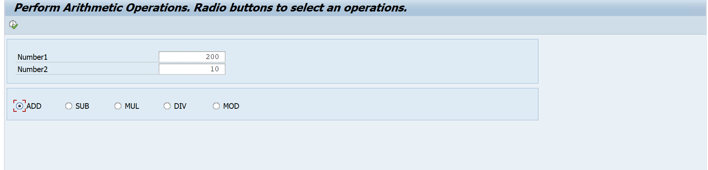
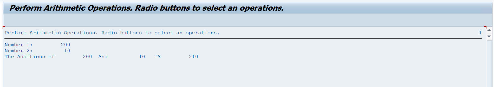
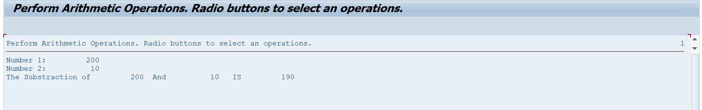
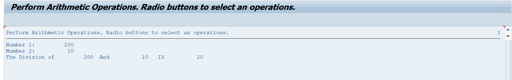
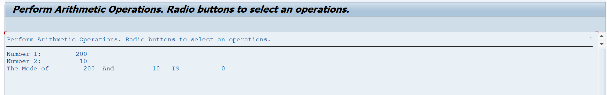

# Assignment 11 - Arithmetic Operations Using Radio Buttons

## 📖 Problem Statement

Write an SAP ABAP Classical Report to perform different **Arithmetic Operations** based on the operation selected by the user through radio buttons.

The program accepts two numbers and provides the following operations:

* ➕ Addition
* ➖ Subtraction
* ✖️ Multiplication
* ➗ Division
* `%` Modulus

The program also validates division by zero.

---

## 🎯 Objective

The objective of this assignment is to understand:

* Selection Screen
* Parameters
* Radio Buttons
* Radio Button Groups
* Selection Screen Events
* Arithmetic Operators
* Conditional Statements
* Input Validation
* Classical Report Programming

---

## 🛠 SAP Concepts Used

* Classical Report
* Selection Screen Blocks
* Parameters
* Radio Buttons
* `RADIOBUTTON GROUP`
* `USER-COMMAND`
* `INITIALIZATION`
* `AT SELECTION-SCREEN OUTPUT`
* `AT SELECTION-SCREEN`
* `START-OF-SELECTION`
* `END-OF-SELECTION`
* `IF...ELSEIF...ENDIF`
* Arithmetic Operators
* `MESSAGE` Statement
* `WRITE` Statement

---

## 📥 Input

The program accepts two numbers:

| Field    | Description   |
| -------- | ------------- |
| Number 1 | First number  |
| Number 2 | Second number |

The user then selects an operation using radio buttons.

### Available Operations

```text
Addition
Subtraction
Multiplication
Division
Modulus
```

---

## ⚙️ Program Logic

1. Accept two numbers from the selection screen.
2. Display the arithmetic operation options using radio buttons.
3. The **Addition** radio button is selected by default.
4. Check the selected radio button.
5. Perform the corresponding arithmetic operation.
6. Store the calculated result in the result variable.
7. Display both input numbers and the calculated result.
8. If Division is selected and Number 2 is `0`, display an error message.

---

## 🧮 Arithmetic Operations

### ➕ Addition

```text
Result = Number 1 + Number 2
```

Example:

```text
10 + 5 = 15
```

---

### ➖ Subtraction

```text
Result = Number 1 - Number 2
```

Example:

```text
10 - 5 = 5
```

---

### ✖️ Multiplication

```text
Result = Number 1 × Number 2
```

Example:

```text
10 × 5 = 50
```

---

### ➗ Division

```text
Result = Number 1 DIV Number 2
```

Example:

```text
10 DIV 5 = 2
```

---

### `%` Modulus

```text
Result = Number 1 MOD Number 2
```

Example:

```text
10 MOD 3 = 1
```

---

## ⚠️ Validation

The program prevents division by zero.

If the user selects **Division** and enters:

```text
Number 2 = 0
```

the program displays:

```text
Division by zero is not allowed
```

---

## 📊 Sample Output

### Example 1 - Addition

**Input**

```text
Number 1 : 10
Number 2 : 5
Operation: Addition
```

**Output**

```text
Number 1: 10
Number 2: 5
The Additions of 10 And 5 IS 15
```

---

### Example 2 - Subtraction

**Input**

```text
Number 1 : 10
Number 2 : 5
Operation: Subtraction
```

**Output**

```text
Number 1: 10
Number 2: 5
The Substraction of 10 And 5 IS 5
```

---

### Example 3 - Multiplication

**Input**

```text
Number 1 : 10
Number 2 : 5
Operation: Multiplication
```

**Output**

```text
Number 1: 10
Number 2: 5
The MUL of 10 And 5 IS 50
```

---

### Example 4 - Division

**Input**

```text
Number 1 : 10
Number 2 : 5
Operation: Division
```

**Output**

```text
Number 1: 10
Number 2: 5
The Division of 10 And 5 IS 2
```

---

### Example 5 - Modulus

**Input**

```text
Number 1 : 10
Number 2 : 3
Operation: Modulus
```

**Output**

```text
Number 1: 10
Number 2: 3
The Mode of 10 And 3 IS 1
```

---

## 📂 Project Structure

```text
Assignment-11/
│
├── Assignment11.abap
├── README.md
├── USERINPUT.png
├── OUTPUT_ADDITION.png
├── OUTPUT_SUBTRACTION.png
├── OUTPUT_MULTIPLICATION.png
├── OUTPUT_DIVISION.png
└── OUTPUT_MODULUS.png
```

---

## 💡 Learning Outcomes

After completing this assignment, I learned:

* How to create radio buttons on a selection screen.
* How to group radio buttons using `RADIOBUTTON GROUP`.
* How to use selection screen events.
* How to perform different arithmetic operations.
* How to use `DIV` and `MOD` operators.
* How to validate division by zero.
* How to display different results based on user selection.
* How to use `MESSAGE` and `WRITE` statements.

---

## 📸 Screenshots

### 📝 User Input - Arithmetic Operations

<p align="center">
  
</p>

---

### ➕ Addition Output

<p align="center">
  
</p>

---

### ➖ Subtraction Output

<p align="center">
  
</p>

---

### ✖️ Multiplication Output

<p align="center">
  
</p>

---

### ➗ Division Output

<p align="center">
  
</p>

---

### `%` Modulus Output

<p align="center">
  
</p>

---

### ⚠️ Division by Zero Validation

<p align="center">
  
</p>

---

## 👨‍💻 Author

**Krantikumar Patil**

SAP ABAP on HANA Learner

## 🤝 Connect With Me

* 💼 **LinkedIn:** [Krantikumar Patil](https://www.linkedin.com/in/krantikumarpatil4211/)
* 🌐 **Portfolio:** [Kranti AI Portfolio](https://kranti-ai.vercel.app/)

---

### 🚀 SAP ABAP Learning Journey

**Day 11 / 30 — SAP ABAP Classical Report Assignments**
