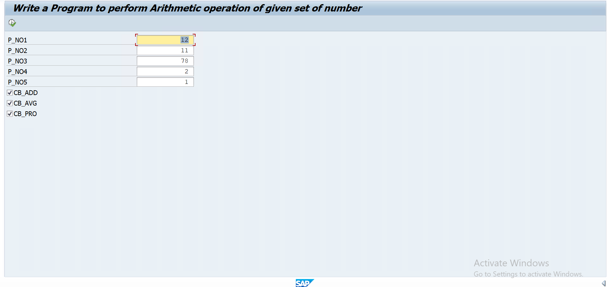
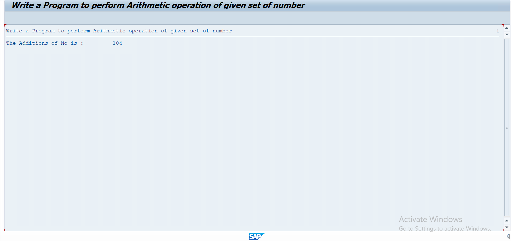
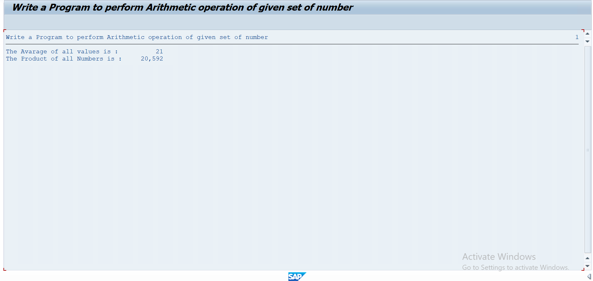

# Assignment 12 - Sum, Average and Product Using Checkboxes

## 📖 Problem Statement

Write an SAP ABAP Classical Report to perform arithmetic operations on a set of **five numbers**.

The user enters five numbers and uses **checkboxes** to select the required operations:

* ➕ Sum
* 📊 Average
* ✖️ Product

The program also validates that the entered numbers are **zero or greater than zero**.

---

## 🎯 Objective

The objective of this assignment is to understand:

* Selection Screen
* Multiple Parameters
* Checkboxes
* Input Validation
* Arithmetic Operations
* Conditional Statements
* Selection Screen Events
* Classical Report Programming

---

## 🛠 SAP Concepts Used

* Classical Report
* Selection Screen
* Parameters
* Checkboxes
* `AS CHECKBOX`
* `AT SELECTION-SCREEN`
* `START-OF-SELECTION`
* `END-OF-SELECTION`
* `IF...ENDIF`
* Arithmetic Operators
* `MESSAGE` Statement
* `WRITE` Statement

---

## 📥 Input

The program accepts five numbers:

| Field    | Description         |
| -------- | ------------------- |
| Number 1 | First input number  |
| Number 2 | Second input number |
| Number 3 | Third input number  |
| Number 4 | Fourth input number |
| Number 5 | Fifth input number  |

The user can select the required operations using checkboxes.

### Available Operations

```text
☐ Sum
☐ Average
☐ Product
```

---

## ⚙️ Program Logic

1. Accept five numbers from the selection screen.
2. Validate that all numbers are zero or greater than zero.
3. Display checkboxes for selecting the required operations.
4. Check which checkbox is selected.
5. Calculate the selected operation.
6. Display the calculated result.

---

## ✅ Validation

The program checks whether any entered number is negative.

The validation condition is:

```text
Number >= 0
```

If any number is less than zero, the following error message is displayed:

```text
GIVE THE NUMBERS ZERO OR GREATER THAN ZERO
```

---

## ➕ Sum Logic

If the **Sum** checkbox is selected:

```text
Sum = Number 1 + Number 2 + Number 3 + Number 4 + Number 5
```

### Example

```text
10 + 20 + 30 + 40 + 50 = 150
```

Output:

```text
The Additions of No is : 150
```

---

## 📊 Average Logic

If the **Average** checkbox is selected:

```text
Average = (Number 1 + Number 2 + Number 3 + Number 4 + Number 5) / 5
```

### Example

```text
10 + 20 + 30 + 40 + 50 = 150

Average = 150 / 5

Average = 30
```

Output:

```text
The Avarage of all values is : 30
```

> **Note:** The current program stores the average in an integer variable (`TYPE i`), so the result is handled as an integer.

---

## ✖️ Product Logic

The product is calculated by multiplying all five numbers:

```text
Product = Number 1 × Number 2 × Number 3 × Number 4 × Number 5
```

### Example

```text
2 × 3 × 4 × 5 × 6 = 720
```

Output:

```text
The Product of all Numbers is : 720
```

---

## 📊 Sample Input

```text
Number 1 : 2
Number 2 : 3
Number 3 : 4
Number 4 : 5
Number 5 : 6

Selected Operations:

☑ Sum
☑ Average
☑ Product
```

---

## 📊 Sample Output

```text
The Additions of No is : 20
The Avarage of all values is : 4
The Product of all Numbers is : 720
```

---

## ⚠️ Validation Example

### Input

```text
Number 1 : 10
Number 2 : -5
Number 3 : 20
Number 4 : 30
Number 5 : 40
```

### Output

```text
GIVE THE NUMBERS ZERO OR GREATER THAN ZERO
```

---

## 📂 Project Structure

```text
Assignment-12/
│
├── Assignment12.abap
├── README.md
├── USERINPUT.png
├── OUTPUT_SUM.png
├── OUTPUT_AVERAGE.png 
└── OUTPUT_PRODUCT.png
```

---

## 💡 Learning Outcomes

After completing this assignment, I learned:

* How to create multiple parameters on a selection screen.
* How to create checkboxes using `AS CHECKBOX`.
* How to validate multiple input fields.
* How to perform Sum, Average, and Product calculations.
* How to use `AT SELECTION-SCREEN` for validation.
* How to use conditional statements based on checkbox selection.
* How to display calculated results using a Classical Report.

---

## 📸 Screenshots

### 📝 User Input & Checkbox Selection

<p align="center">
  
</p>

---

### ➕ Sum Output

<p align="center">
  
</p>

---

### 📊 Average Output

<p align="center">
  
</p>

---

### ✖️ Product Output

<p align="center">
  
</p>

---

## 🔎 Code Observation

In the current ABAP code, the Product calculation uses:

```abap
IF cb_avg = 'X'.
```

This means the Product calculation is triggered when the **Average checkbox** is selected.

The intended condition is most likely:

```abap
IF cb_pro = 'X'.
```

This should be corrected if the Product checkbox is supposed to control the Product calculation.

---

## 👨‍💻 Author

**Krantikumar Patil**

SAP ABAP on HANA Learner

## 🤝 Connect With Me

* 💼 **LinkedIn:** [Krantikumar Patil](https://www.linkedin.com/in/krantikumarpatil4211/)
* 🌐 **Portfolio:** [Kranti AI Portfolio](https://kranti-ai.vercel.app/)

---

### 🚀 SAP ABAP Learning Journey

**Day 12 / 30 — SAP ABAP Classical Report Assignments**
